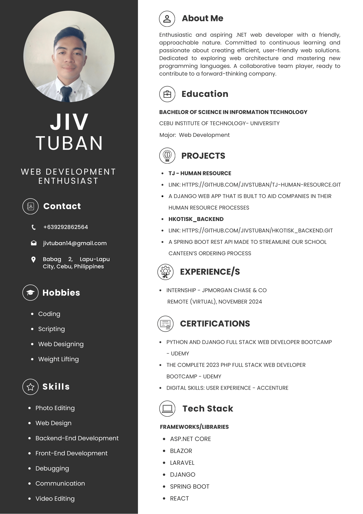

lanzbviot
NAME: VINCE KYRIE T. SEVILLE

COURSE: BSIT-3

I am VINCE KYRIE SEVILLE, 22 Years Old. I like playing video games!

**Name:** Jiv S. Tuban  
**Course:** BSIT-3

## Professional Summary

I am a Fullstack Web Developer with expertise in:

- 💻 Creating intuitive user experiences
- ⚙️ Developing robust backend systems
- 🎯 Building efficient web solutions
- ✨ Writing clean, maintainable code

### Key Strengths

- Strong problem-solving skills
- Collaborative team player
- Committed to continuous learning
- Up-to-date with emerging technologies

## CV

---

*Building the future of web, one line of code at a time.*

# IT342-G2

Name: Jared Chester S. Canasa

Course: BSIT - 3

I am Jared Chester S. Canasa, I'm 21 years old and I
like watching movies and sleeping.

Name: Janine P. Giducos Course: BSIT - 3 About Me:
I am a simple person. 
=======

NAME: SILANGAN, JAMES RHUZELLE
COURSE: BSIT-3

ABOUT MYSELF: simple person.X

NAME: ANDRE LIM PORCINA
COURSE: BSIT - 3

ABOUT MYSELF:
I AM A GOOD PERSON AHEHEH

NAME: MANWARUL FRANCIS C. SANTOS
COURSE: BSIT - 3

I AM A CODM PLAYER. 

NAME: JUDIEL OPPURA

COURSE: BSIT-3

ABOUT MYSELF:

##I'm mj and I'm 21 years old. I like playing games and listening to chill music.

  <!-- Animated Greeting -->
  

    
  

    <h1>IT342-G2</h1>

## Jared Karl A. Omen

<!-- About Me Section with Floating Animation -->
<h2>
  About Me
</h2>

- 💻 IT student passionate about programming
- 🌱 Currently learning and growing my development skills
- 🚀 Love exploring new technologies

# About me:
Name: Lanz Roy L. Sumalpong
Course: BSIT-3

Hi I'm a student in CIT and a future System Admin

=======
# IT342-G2

NAME: LIRASAN, JAPHET A.
COURSE: BSIT-3

ABOUT MYSELF:
I'm a normal person.

NAME: Muttia Selgas
COURSE: BSIT

ABOUT MYSELF:
I am nonchalant.

NAME: Achilles Niño Castañeda

COURSE: BSIT-3

I am Achilles Niño V. Castañeda. I am 21 years old. I am in an identity crisis and is stuck what path to choose in life, but I love making music and playing games. My main dream
is to become a Music Composer. Taking this IT course is just a mean to financially support my dream.

Name: Mike Francis Alon
Course: BSIT-3
 
## About Me
 
I'm an easygoing and dependable person who enjoys playing mobile and ball games. Watching movies is one of my favorite ways to unwind in my free time.
 
As an IT student, I'm passionate about technology and always eager to learn new skills. I'm excited to grow in the field and make an impact in the tech world!

<h3>NAME: ANDRI M. APAS 
COURSE: BSIT-3 </h3>

<h4>About Myself</h4>

Hello I'm Andri Apas a BSIT Third year student in Cebu Institute Technology - University.
My hobbies when I am productive is reading books, learning new coding method, and 
watching GitHub. I also have hobbies for leisure time which is going to gym, biking, and 
sleeping.

Name: Josemar Pajares
Program and Year: BSIT - 3
## About Me

    Name: Josh Kyle E. Cervantes
    Year and Course: BSIT-3 G2

### Introduction

    I am a passionate creative professional with a strong background in various aspects of digital media and design. My career focus is on leveraging my technical skills and creativity to deliver visually compelling and user-friendly solutions.

### Strengths

- **Photography:** Skilled in capturing high-quality images that tell a story and evoke emotions.
- **Graphics Design:** Proficient in creating visually appealing designs for various media platforms.
- **Photo and Video Editing:** Experienced in editing photos and videos to enhance their visual impact and storytelling.
- **UX/UI Design:** Adept at designing intuitive and engaging user interfaces that provide a seamless user experience.
- **Continuous Learning:** Committed to continuous learning and improvement to keep my skills sharp and up-to-date.

# Name Danrave Keh

Currenly studying at Cebu Institure of Technology - University. 
My goal is to become a web developer or game developer after honing my skills.

# Name Danrave Keh
# Course: BSIT-3
# About Myself Gekapoy

NAME: JOHN ERIC E. LUMAMBAS
COURSE: BSIT - 3

I AM JOHN ERIC E. LUMAMBAS, A HARDWORKING STUDENT WHO STRIVES TO PASS ALL SUBJECT WITHOUT FAILING.

NAME: RICHELLE VILLANUEVA
COURSE & YEAR: BSIT-3
ABOUT ME: I like music, movies and buying clothes. I love to thrift and cut my bangs short. I love you. 

**Name:** Nathaniel Salvoro
**Program and Year:** BSIT - 4

**About me**
I'm currently studying in Cebu Institute of Technology - University.
I aspire to be a web developer and UI/UX designer after I graduate.
yey

Name : Shaina F. Miparanum
Year : BSIT 3

NAME: MIKLOS KAISER A. BOLARDE
COURSE: BSIT-3

ABOUT MYSELF
I AM AN UNDERSTANDING PERSON WITH A GREAT PERSONALITY AND WITH A GENTLE HEART <3

NAME: DAVE MARK D> CRYSTAL
COURSE: BSIT-3

ABOUT MY SELF
I AM A SIMPLE AND HUNMBLE PERSON
NAME: Paulo Carabuena
COURSE: BSIT-3

I am not myself because I lose myself when I can't eat dinosaur 🦖

**Name**: Kurt Bryan C. Navaja
**Course & Year**: BSIT-3

I like to go to the gym, play some online games, and play volleyball.

NAME: MIKAEL LORENZO A. CUYUGAN
COURSE: BSIT-3

ABOUT MYSELF
I LOVE LISTENING TO MUSIC 

NAME: AERON CLYDE ESPINA
COURSE: BSIT-3

ABOUT MY SELF:

I'm just a simple person, I have simple dreams and goals in life.
I am good with computers, hardware and software. I like watching anime and history movies.

Name: ALDRIN JOHN VITORILLO
COURSE: BSIT-3

ABOUT MY SELF
Hi, I'm Aldrin John, a web developer with a strong interest. Making games and websites is my area of expertise. 

Vincent B. Pacaña
BSIT - 3
I am a person who likes to explore and try out new things!

NAME: CHARLES WILLIAM R. SEVENIAL

COURSE: BSIT-3

I AM CHARLES WILLIAM SEVENIAL, I AM 21 YEARS OLD. I LIKE WATCHING MOVIES AND LISTENING TO MUSIC

NAME: VAN HARVEY R. COCA
COURSE: BSIT-3

I'm Ban Coca, from Cebu Philippines

I’m currently a student in Cebu Institute of Technology - University

